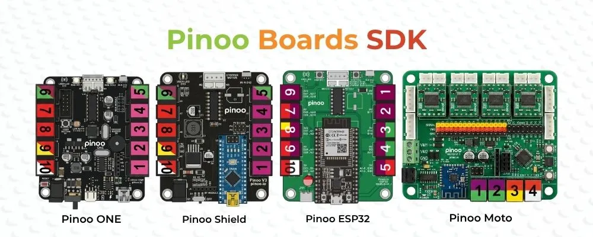

# Pinoo SDK (Software Development Kit)

Pinoo SDK is the official software development kit developed for Pinoo ONE, Pinoo Shield, Pinoo Bricky, Pinoo Moto, and Pinoo ESP32 boards. It enables students and educators to easily program their robotics and electronics projects in text-based C++ using the Arduino IDE.

By simplifying complex hardware and register operations, this SDK provides clear, modular, and easy-to-use C++ classes (e.g., `Pinoo_Led`, `Pinoo_Buzzer`, `Pinoo_DcMotor`).

---

## 🎯 Key Features

* **Wide Board Support:** Full compatibility with all AVR and ESP32 architecture Pinoo boards.
* **Simplified Module Classes:** Plug-and-play libraries tailored for RJ11 connection structures.
* **Rich Example Code Library:** Ready-to-use, tested example codes for each board and sensor.
* **Built-in IoT Support:** Out-of-the-box cloud integration for ESP32 projects via ThingsBoard and WiFiManager.

---

## 📸 Images

 

---

## 🗺️ Architectural Structure

The diagram below shows how the Pinoo SDK acts as a bridge between user code, hardware, and underlying low-level libraries:

```mermaid
graph TD
    UserCode[User Code / Sketch] -->|Pinoo.h and Module APIs| SDK[Pinoo SDK Core]
    SDK -->|Boards Configuration| PinConfig[Pin Maps / src/boards]
    SDK -->|Third-Party Underlay| ExtLibs[Open Source Libraries]
    
    subgraph Hardware Support
        PinConfig -->|AVR Platform| AVR[Pinoo ONE / Shield / Bricky / Moto]
        PinConfig -->|ESP32 Platform| ESP[Pinoo ESP32]
    end
    
    subgraph libraries/ (Dependencies)
        ExtLibs --> Adafruit[Adafruit NeoPixel / PWM Driver]
        ExtLibs --> IR[IRremote]
        ExtLibs --> LCD[LiquidCrystal I2C]
        ExtLibs --> TB[ThingsBoard / TBPubSubClient]
        ExtLibs --> WM[WiFiManager]
        ExtLibs --> JSON[ArduinoJson]
    end
```

---

## 🔌 Compatible Boards Table

| Board Name | Architecture | Microcontroller | Key Features |
| :--- | :--- | :--- | :--- |
| **Pinoo ONE** | AVR | ATmega328P | Main standalone programmable robotics board |
| **Pinoo Shield** | AVR | ATmega328P (Nano) | RJ11 extension shield mounted on Arduino Nano |
| **Pinoo Bricky** | AVR | ATmega328P | LEGO-compatible miniature robotics board |
| **Pinoo Moto** | AVR | ATmega328P | Advanced board with 8x DC / 4x Stepper motor drivers & Bluetooth |
| **Pinoo ESP32** | ESP32 | ESP32-WROOM-32 | Development board with built-in Wi-Fi, Bluetooth & IoT features |

---

## 📂 Directory Structure

```text
pinoo_sdk/
├── src/                          # Main SDK Source Files
│   ├── Pinoo.h                   # Main Library Header
│   ├── boards/                   # Board-Pin Configurations (.h and .cpp)
│   └── modules/                  # Sensor & Actuator Libraries (LED, Buzzer, Motor, etc.)
├── examples/                     # Arduino IDE Examples
│   ├── Pinoo_ONE/                # Pinoo ONE example projects
│   ├── Pinoo_Shield/             # Pinoo Shield example projects
│   ├── Pinoo_Bricky/             # Pinoo Bricky example projects
│   ├── Pinoo_Moto/               # Pinoo Moto (Multi-Motor) example projects
│   └── Pinoo_ESP32/              # Pinoo ESP32 (IoT/Wi-Fi) example projects
├── hardware/                     # Arduino IDE Board Manager Packages
│   ├── avr/                      # AVR Board Definitions & Libraries (1.0.2)
│   └── esp32/                    # ESP32 Board Definitions & Libraries (1.0.2)
├── library.properties            # Arduino Library Metadata File
└── package_pinoo_index.json      # Arduino Board Manager JSON File
```

---

## 🛠️ Arduino IDE Installation Guide

Follow these steps to integrate Pinoo boards and SDK libraries into your Arduino IDE:

### 1. Configure Board Manager URLs
1. Open Arduino IDE.
2. Go to **File** -> **Preferences**.
3. Paste these three URLs into the **Additional Boards Manager URLs** field (you can click the window icon to the right of the input to enter them on separate lines):
   ```url
   https://arduino.esp8266.com/stable/package_esp8266com_index.json
   https://espressif.github.io/arduino-esp32/package_esp32_index.json
   https://raw.githubusercontent.com/mobilitysoftware/pinoo_boards_arduino/main/package_pinoo_index.json
   ```
4. Click **OK** to save preferences.

### 2. Install Board Packages
1. Go to **Tools** -> **Board** -> **Boards Manager...** (or click the board manager icon on the left sidebar).
2. Search for **Pinoo**.
3. Locate **Pinoo AVR Boards** and **Pinoo ESP32 Boards**, and click **Install** for both.

### 3. Sürücü (Driver) Installation (If Required)
Pinoo boards use the **CH340** USB-to-Serial converter chip to communicate with computers. If your board does not appear under the `Port` menu when connected, [download and install the CH340 Driver](https://www.wch-ic.com/downloads/ch341ser_zip.html).

---

## 📖 Accessing and Using Examples

Once installation is complete, you can access example codes directly from the Arduino IDE:

1. Go to **File** -> **Examples** -> **Pinoo Modules** (or the specific board's example folder).
2. Choose the code of the module you want to use.
3. You can use the template below to write your own custom sketches:

```cpp
#include <Pinoo.h>

// Initialize a LED module connected to Port 1 (RJ11) of Pinoo ONE
Pinoo_Led led(DOOR1, 1);

void setup() {
  // Start the LED module
  led.begin();
}

void loop() {
  led.ledOn();   // Turn on the LED
  delay(1000);   // Wait 1 second
  led.ledOff();  // Turn off the LED
  delay(1000);   // Wait 1 second
}
```

---

## 🤝 Open Source Libraries and Attributions

Pinoo SDK relies on several outstanding open-source libraries and frameworks developed by the Arduino community. We extend our sincere gratitude to the authors and contributors of these projects:

| Library / Project | Purpose | Developer / Owner | License |
| :--- | :--- | :--- | :--- |
| **Adafruit NeoPixel** | WS2812 Addressable RGB LED control | Adafruit Industries | LGPL-3.0 |
| **Adafruit BusIO** | I2C and SPI hardware communication helpers | Adafruit Industries | BSD-3-Clause |
| **Adafruit PWM Servo Driver** | PCA9685 PWM driver control (Pinoo Moto) | Adafruit Industries | BSD-3-Clause |
| **ArduinoJson** | JSON serialization and deserialization | Benoît Blanchon | MIT |
| **IRremote** | Infrared (IR) transmitter & receiver signal management | shirriff, z3t0, Armin Joachimsmeyer | MIT |
| **LiquidCrystal I2C** | Control of I2C character LCDs | Frank de Brabander | LGPL-2.1 |
| **ServoESP32** | Stable Servo control on ESP32 boards | Jaroslav Paral | GPL-3.0 |
| **ThingsBoard** | ThingsBoard IoT cloud client integration | ThingsBoard Authors | Apache-2.0 |
| **TBPubSubClient** | MQTT messaging abstraction (based on PubSubClient) | Nick O'Leary | MIT |
| **WiFiManager** | WiFi credential portal configuration on ESP32 | tzapu, tablatronix | GPL-3.0 |

---

## ⚖️ License and Copyright Information

This SDK has been developed by **Mobility Software** specifically for **Pinoo Robotics**.

All rights reserved © **Mobility Software** & **Atölye Vizyon**.

* 🌐 [Mobility Software](https://mobilitysoftware.net)
* 🌐 [Pinoo Robotics](https://pinoo.io)
* 🌐 [Atölye Vizyon](https://www.atolyevizyon.com)
